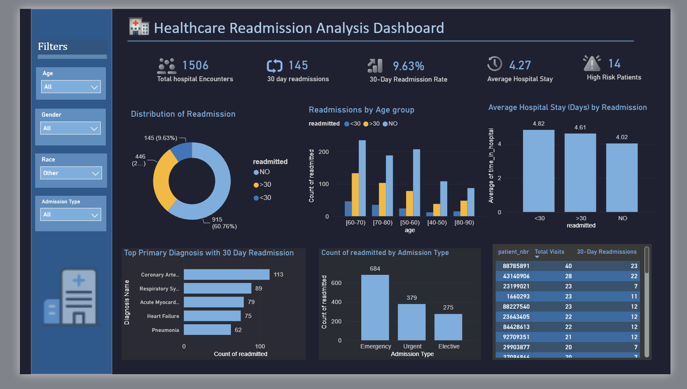

# 🏥 Healthcare Readmission Analysis
### Identifying Factors Affecting Hospital Readmissions to Reduce Unnecessary 30-Day Readmissions


---

## 📌 Project Overview

Hospital readmissions within **30 days** are one of the most important healthcare quality indicators. Frequent readmissions increase healthcare costs, strain hospital resources, and may indicate gaps in patient care or discharge planning.

This project analyzes over **101,000 hospital encounters** from diabetic patients to identify the factors influencing readmission and provide data-driven recommendations to reduce unnecessary readmissions.

The project combines **Python**, **SQL**, and **Power BI** to clean, analyze, visualize, and interpret healthcare data.

---

# 🎯 Problem Statement

> **What factors affect hospital readmissions, and how can healthcare providers reduce unnecessary 30-day readmissions?**

To answer this question, the analysis investigates:

- Patient demographics
- Length of hospital stay
- Age groups
- Admission types
- Primary diagnoses
- High-risk patients
- Readmission trends

---

# 📊 Dataset

**Dataset:** Diabetes 130-US Hospitals (1999–2008)

### Dataset Summary

| Metric | Value |
|---------|-------|
| Hospital Encounters | **101,766** |
| Features | **45** |
| Patients | Multiple encounters per patient |
| Target Variable | Readmitted (<30, >30, NO) |

---

# 🛠 Tech Stack

- Python
- Pandas
- NumPy
- Matplotlib
- Seaborn
- MySQL
- Power BI
- Jupyter Notebook

---

# 📂 Project Structure

```
Healthcare-Readmission-Analysis
│
├── data
│   ├── diabetic_data.csv
│   ├── diabetic_data_cleaned.csv
│   └── IDS_mapping.csv
│
├── notebooks
│   ├── diabetes_PreProcessing.ipynb
│   └── EDA_diabetes.ipynb
│
├── sql
│   └── diabetes_readmission_analysis.sql
│
├── power_bi_dashboard
│   ├── Readm_dashboard.pbix
│   └── dashboard.png
│
├── README.md
└── requirements.txt
```

---

# 🔄 Project Workflow

```
Raw Dataset
      │
      ▼
Data Cleaning (Python)
      │
      ▼
Exploratory Data Analysis
      │
      ▼
SQL Business Analysis
      │
      ▼
Power BI Dashboard
      │
      ▼
Business Insights & Recommendations
```

---

# 🧹 Data Cleaning

Performed using **Python (Pandas)**

✔ Removed duplicates

✔ Handled missing values

✔ Replaced invalid entries

✔ Converted data types

✔ Standardized categorical values

✔ Prepared analysis-ready dataset

---

# 📈 Exploratory Data Analysis

The following relationships were explored:

- Readmission distribution
- Age vs Readmission
- Gender vs Readmission
- Hospital stay vs Readmission
- Admission Type
- Primary Diagnosis
- Correlation among numerical variables

---

# 🗄 SQL Analysis

Business questions answered using SQL:

- Which age groups have the highest readmission rates?
- Does longer hospital stay increase readmission?
- Which diagnoses contribute most to 30-day readmissions?
- Which admission types generate the highest readmissions?
- Who are the highest-risk patients?
- What percentage of encounters are readmitted within 30 days?

Advanced SQL techniques used:

- CTEs
- Window Functions
- DENSE_RANK()
- Aggregate Functions
- CASE Statements
- GROUP BY
- HAVING

---
*Tools used per step:*
*Data cleaning & correlation analysis — Python (Pandas/Seaborn);*
*Business question answering & ranking — SQL; *
*Visualization — Power BI.*


# 📊 Dashboard KPIs

| KPI | Value |
|------|------:|
| Total Hospital Encounters | **101,766** |
| 30-Day Readmissions | **11,357** |
| 30-Day Readmission Rate | **11.16%** |
| Average Hospital Stay | **4.40 Days** |
| High-Risk Patients | Dynamic (Filter Based) |

---

# 🔍 Key Insights

## 1️⃣ Readmission Distribution

| Readmission Status | Encounters | Percentage |
|-------------------|-----------:|-----------:|
| NO | 54,864 | 53.91% |
| >30 Days | 35,545 | 34.93% |
| <30 Days | 11,357 | 11.16% |

### Insight

Although only **11.16%** of encounters resulted in readmission within 30 days, these patients represent the highest priority because early readmissions are largely preventable and contribute significantly to healthcare costs.

---

## 2️⃣ Hospital Stay vs Readmission

| Readmission | Average Stay |
|-------------|-------------:|
| <30 | **4.77 Days** |
| >30 | **4.50 Days** |
| NO | **4.25 Days** |

### Insight

Patients readmitted within 30 days stayed longer during their initial hospitalization, suggesting increased clinical complexity.

---

## 3️⃣ Age Group Analysis

Highest number of readmissions occurred in:

- 70–80 years
- 60–70 years
- 80–90 years

However,

The **20–30** age group recorded the highest readmission rate (**14.24%**), indicating that although fewer younger patients are hospitalized, those admitted have a comparatively higher likelihood of early readmission.

---

## 4️⃣ Primary Diagnoses Driving Readmission

Top diagnoses associated with 30-day readmissions:

- Heart Failure
- Coronary Artery Disease
- Acute Myocardial Infarction
- Pneumonia
- Respiratory Disorders

These conditions should receive enhanced discharge planning and follow-up care.

---

## 5️⃣ Admission Type

Emergency admissions contributed the largest share of readmissions, followed by Urgent admissions.

### Insight

Emergency patients often require immediate care with limited opportunities for preventive intervention before admission.

---

## 6️⃣ High-Risk Patients

Patients with repeated hospital encounters were identified using SQL.

These individuals may benefit from:

- Care management programs
- Post-discharge monitoring
- Frequent follow-up appointments
- Medication adherence programs

---

# 📈 Interactive Dashboard



```
power_bi_dashboard/dashboard.png
```

---

# 💡 Recommendations

Based on the analysis, hospitals can reduce unnecessary readmissions by:

- Prioritizing follow-up care for patients discharged after longer hospital stays.
- Implementing specialized discharge protocols for cardiovascular and respiratory diseases.
- Increasing monitoring for frequently admitted patients.
- Improving care coordination for emergency admissions.
- Scheduling early outpatient follow-up visits for high-risk individuals.
- Strengthening patient education regarding medication adherence and disease management.

---


# 👩‍💻 Author

**Khushi Baliyan**

B.Tech Computer Science Engineering

Aspiring Data Analyst


---

## ⭐ If you found this project interesting, consider giving it a star!
